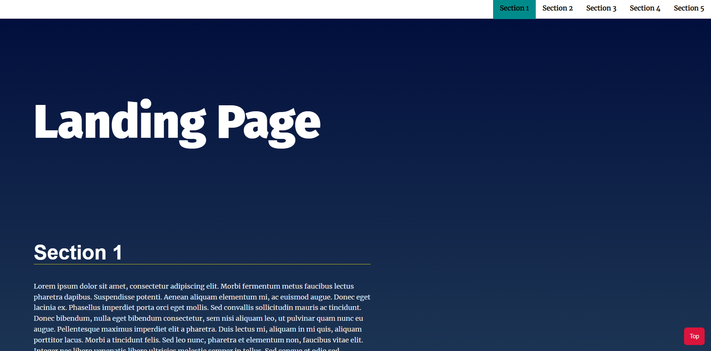
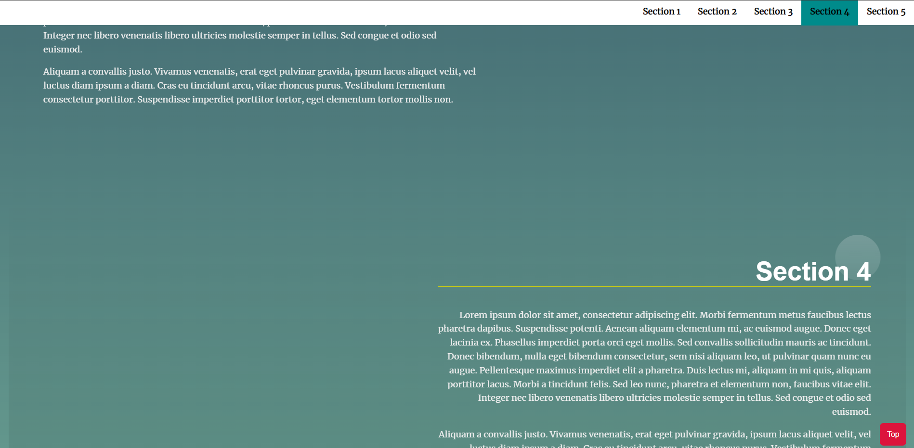
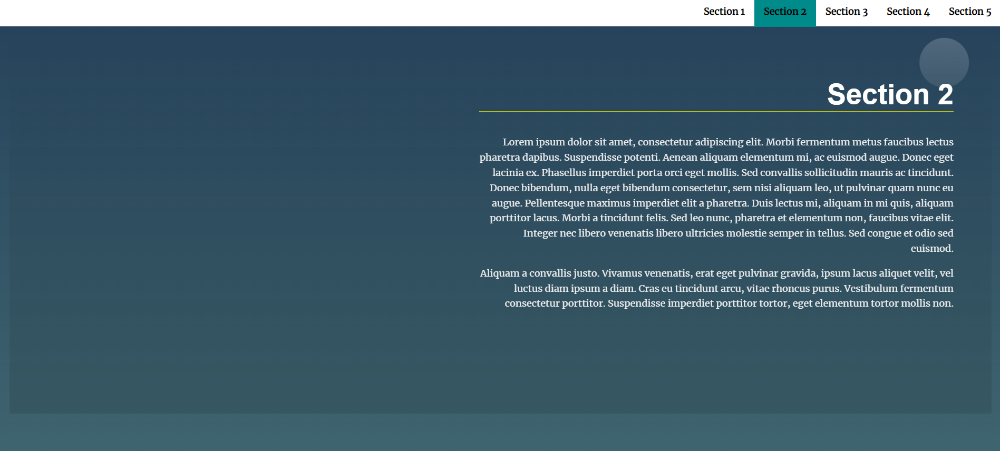

# Landing Page

 

A multi-section landing page, with a dynamically updating navigational menu based on the amount of content that is added to the page.

 

## Features
 

- Navigation menu built dynamically at run time based on the number of sections added to the page
- Section in view is distinguished by other sections by having a special CSS style and a highlighted button in the nav bar
- Smooth scrolling upon clicking to view any section item
- Responsive landing page which works across all devices
- Scroll to top button to easily reach the top of the page

## Preview

